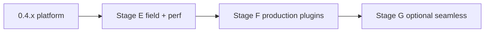

# OpenStream Engine — Roadmap

Актуальная база: **0.4.2**. Связанные документы: [ARCHITECTURE.md](ARCHITECTURE.md), [PERFORMANCE.md](PERFORMANCE.md), [PLUGIN_ARCHITECTURE.md](PLUGIN_ARCHITECTURE.md), [PROXY_ARCHITECTURE.md](PROXY_ARCHITECTURE.md), [DASH_ARCHITECTURE.md](DASH_ARCHITECTURE.md), [COEXISTENCE.md](COEXISTENCE.md), [SDK.md](SDK.md), [adr/0001-plugin-abi.md](adr/0001-plugin-abi.md).

## Легенда статусов

- `[x]` выполнено и уже отражено в коде.
- `[~]` частично выполнено; нужен follow-up или проверка на реальной БД / живом CDN / SoC.
- `[ ]` не сделано.
- `[blocked]` заблокировано внешним окружением или данными.

---

## Принципы (не менять)

- Клиент не патчим — только манифесты (и при необходимости URL вариантов / заголовки).
- Ядро универсально; сервисная логика только в плагинах.
- Сосуществование с zapret / zapret2 / podkop: своя nft-таблица, explicit proxy по умолчанию, DNS не трогаем.
- Сегменты медиа не держим в RAM.
- Twitch default = **Segment Stripping** (freeze на midroll), не полный vaft.

---

## Stage A — v1.0-hardened

| ID | Задача | Статус |
|----|--------|--------|
| A1 | MITM только `.m3u8` / `.mpd`; медиа — tunnel/stream | `[x]` |
| A2 | Cap размера манифеста; без полной буферизации `.ts` / `.m4s` | `[x]` |
| A3 | Persistent CA + leaf cache по host | `[x]` |
| A4 | Режимы `explicit` / `redirect_whitelist` / `off` + fail-soft nft | `[x]` |
| A5 | DISCONTINUITY после strip; строгий DATERANGE; настоящий `regex` | `[x]` |
| A6 | Proxy unit-тесты; host Criterion benches | `[x]` benches · `[~]` полевой RSS/CPU на SoC |
| A7 | LuCI ↔ демон (`max_wait`/debug/UCI→YAML); ad events | `[x]` каркас · `[~]` калибровка UX логов на устройстве |
| A8 | Clippy + CI | `[x]` |

**Выход этапа:** тестовый OpenWrt + Twitch через explicit proxy — **каркас закрыт**; полевые цифры — Stage E.

---

## Stage B — Universal HLS (v1.1 / 0.2.0)

| ID | Задача | Статус |
|----|--------|--------|
| B1 | Plugin API: `filter_segments` / `rewrite_urls` / `capabilities` | `[x]` |
| B2 | Rule engine YAML (`ose-rules`) | `[x]` |
| B3 | Kick / Trovo / generic HLS plugin | `[x]` stub · `[~]` маркеры на живом CDN |
| B4 | Master rewrite через `proxy_public_url` | `[x]` |
| B5 | Hot-reload `/api/reload` + SIGHUP | `[x]` |
| B6 | Prefetch policy ядра | `[x]` |

---

## Stage C — DASH (v2.0 / 0.3.0)

| ID | Задача | Статус |
|----|--------|--------|
| C1 | Парсер MPD (`ose-dash`) | `[x]` |
| C2 | Фильтр Period / AdaptationSet | `[x]` stub rules · `[~]` провайдерская калибровка |
| C3 | CMAF passthrough (не буферизовать `.m4s`) | `[x]` |
| C4 | `MediaFilter` / `ManifestKind` (`ose-media`) | `[x]` |
| C5 | `CacheKey` (URL + etag/hash) | `[x]` |

---

## Stage D — Platform SDK (v3.0 / 0.4.x)

| ID | Задача | Статус |
|----|--------|--------|
| D1 | ADR 0001 static ABI + SDK.md + skeleton | `[x]` |
| D2 | Production-quality плагины (Twitch / Kick / Trovo / YouTube) | `[~]` strip + stubs; seamless не готов |
| D3 | Singleflight coalesce (`ose-coalesce`) | `[x]` |
| D4 | OpenMetrics + event ring + LuCI Events/Metrics | `[x]` |
| D5 | Profiles LTO/size + feature flags `slim-twitch` | `[x]` · `[~]` feed CI mips/arm publish |
| D6 | Criterion benches + calibration fixtures (0.4.2) | `[x]` |
| D7 | WASM / cdylib plugins | `[ ]` (осознанно отложено ADR 0001) |

---

## Stage E — Полевая готовность и perf (следующий фокус)

Цель: закрыть разрыв «код на desktop» → «цифры и маркеры на роутере / CDN». См. [PERFORMANCE.md](PERFORMANCE.md).

| ID | Задача | Статус |
|----|--------|--------|
| E1 | Замер `VmRSS` / `VmPeak` streamproxyd на целевом SoC (A53 / mips) | `[ ]` · `[blocked]` нет прогона на устройстве |
| E2 | Замер CPU % при 1–N параллельных Twitch HLS через explicit proxy | `[ ]` · `[blocked]` нет SoC-прогона |
| E3 | Заполнить таблицу фактических цифр в PERFORMANCE.md (vs цели RSS ≤30 МБ, strip ≪1 мс) | `[ ]` |
| E4 | Сверить host Criterion с aarch64 (cross или на устройстве) | `[~]` CI aarch64-musl build есть; цифры benches не зафиксированы |
| E5 | Снять живые midroll/preroll m3u8 Twitch → обновить fixtures | `[ ]` · `[blocked]` нужен живой CDN / аккаунт без Turbo |
| E6 | Калибровка Kick / Trovo / YouTube Live маркеров на реальных плейлистах | `[ ]` · `[blocked]` нужны живые манифесты |
| E7 | Калибровка DASH ad Period (SCTE / провайдер) на реальных MPD | `[ ]` · `[blocked]` нужны живые MPD |
| E8 | Проверка coexist: zapret/podkop + openstream explicit на одном роутере | `[~]` дизайн в COEXISTENCE · `[ ]` полевой smoke |
| E9 | Проверка MITM CA: установка на Android/iOS/TV клиентах + Twitch app/browser | `[ ]` |
| E10 | Документация сборки OpenWrt/LuCI (ipk+apk, A53) + размер slim vs full | `[~]` BUILD_OPENWRT.md · `[ ]` полевые байты `.ipk`/`.apk` |

**Выход Stage E:** PERFORMANCE.md с SoC-цифрами; fixtures не только синтетические; smoke coexist зелёный.

---

## Stage F — Production plugins (без seamless)

| ID | Задача | Статус |
|----|--------|--------|
| F1 | Twitch strip: регрессия на живых fixtures (preroll / midroll / LL prefetch) | `[~]` midroll fixture · `[ ]` полный набор с CDN |
| F2 | Ужесточить false-positive политику (URI Contains / ExtInfNotLive) по полевым логам | `[ ]` |
| F3 | Kick: подтверждённый ruleset + тесты | `[~]` preset · `[ ]` production |
| F4 | Trovo: подтверждённый ruleset + тесты | `[~]` preset · `[ ]` production |
| F5 | YouTube Live: подтверждённый ruleset + тесты | `[~]` preset + URI detect · `[ ]` production |
| F6 | DASH plugin: хотя бы один реальный провайдер с документированными маркерами | `[ ]` |
| F7 | LuCI: предупреждение UX «freeze ≈ длительность midroll» (не vaft) | `[ ]` |
| F8 | `active_streams` / metrics: сверка с реальными CONNECT под нагрузкой | `[~]` счётчик есть · `[ ]` полевая валидация |
| F9 | Multi-plugin compose или явный priority order в конфиге | `[ ]` (сейчас first-match) |
| F10 | Дальнейший trim: `ose-dash` не тянуть в `slim-twitch` транзитивно | `[~]` feature flags · `[ ]` audit deps |

**Выход Stage F:** сервисы с полевыми правилами; ожидания UX явно в UI.

---

## Stage G — Opt-in Twitch seamless (vaft-like backup)

Только после ADR. Default остаётся strip. Не цель Stage E/F.

| ID | Задача | Статус |
|----|--------|--------|
| G0 | ADR: GraphQL `PlaybackAccessToken` / playerType на роутере (egress, ToS, кэш) | `[ ]` |
| G1 | Запрос backup encodings (`embed` / `popout` / `autoplay`) | `[ ]` |
| G2 | Подмена media playlist при `stitched` без падения на strip | `[ ]` |
| G3 | Кэш StreamInfos-like per channel; invalidation при restart stream | `[ ]` |
| G4 | Fallback на strip, если backup с ads / ошибка | `[ ]` (логика strip уже есть) |
| G5 | Флаг `backup_seamless` в UCI/YAML реально включает G1–G4 | `[~]` флаг/scaffold · `[ ]` реализация |
| G6 | Метрики: backup hit / strip fallback / latency | `[ ]` |
| G7 | Документация: отличие от browser-vaft; риски token/headers | `[ ]` |

**Выход Stage G:** opt-in непрерывное видео при midroll; strip всегда safety net.

---

## Вне скоупа (пока)

| Тема | Статус |
|------|--------|
| Blanket transparent redirect всего 443 | `[ ]` намеренно (ломает zapret) |
| Динамические `.so` / WASM plugins | `[ ]` отложено ADR 0001 |
| Патч клиента / Worker inject как в userscript | `[ ]` вне модели роутера |
| Буферизация медиа-сегментов в RAM | `[ ]` запрещено принципами |
| Twitch Turbo / официальный ad-free | вне продукта |

---

## Ближайший спринт (после 0.4.2)

Приоритет — **Stage E**, затем точечно **F1/F7**, seamless не начинать без G0.

1. `[ ]` **E1–E3** — RSS/CPU на SoC → таблица в PERFORMANCE.md  
2. `[ ]` **E5** — живые Twitch fixtures (хотя бы 1 midroll + 1 LL)  
3. `[ ]` **E8** — smoke coexist с zapret/podkop  
4. `[ ]` **F7** — LuCI/README: freeze UX явно  
5. `[ ]` **G0** — ADR только если нужен seamless; иначе оставить scaffold

Сделано в 0.4.2: feature-flags slim-сборок, Criterion benches, URI Contains для YouTube-like, PERFORMANCE.md (без SoC-цифр).
