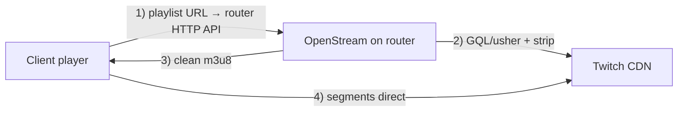
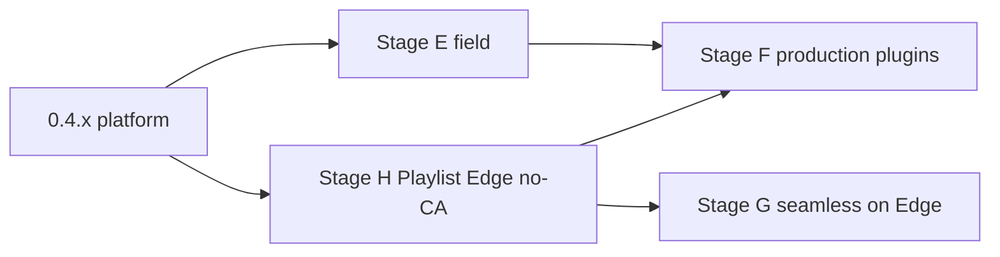

# OpenStream Engine — Roadmap

Актуальная база: **0.4.2** (IPK **14**). Оглавление: [INDEX.md](INDEX.md).

Связанные документы: [ARCHITECTURE.md](ARCHITECTURE.md), [PERFORMANCE.md](PERFORMANCE.md), [PLUGIN_ARCHITECTURE.md](PLUGIN_ARCHITECTURE.md), [PROXY_ARCHITECTURE.md](PROXY_ARCHITECTURE.md), [DASH_ARCHITECTURE.md](DASH_ARCHITECTURE.md), [COEXISTENCE.md](COEXISTENCE.md), [SDK.md](SDK.md), [adr/0001-plugin-abi.md](adr/0001-plugin-abi.md), [adr/0002-playlist-edge.md](adr/0002-playlist-edge.md).

## Легенда статусов

- `[x]` выполнено и уже отражено в коде.
- `[~]` частично выполнено; нужен follow-up или проверка на реальной БД / живом CDN / SoC.
- `[ ]` не сделано.
- `[blocked]` заблокировано внешним окружением или данными.
- `[legacy]` оставлено как opt-in / advanced, не основной путь продукта.

---

## Концепция продукта (с 0.4.x → смена фокуса)

### Жёсткий факт TLS

**Нельзя** прозрачно читать/менять HTTPS (m3u8 Twitch) на роутере без того, чтобы клиент доверял подписи MITM-CA. Это не ограничение OpenWrt — так устроен TLS (mitmproxy/SSLsplit подтверждают то же). «Задействовать все возможности роутера» **не отменяет** этот закон: nft/dnsmasq/TPROXY ловят пакеты, но не расшифровывают их.

Поэтому путь **transparent MITM + установка CA на каждый телефон/ТВ/ПК** снимается с роли default UX: мало кто ставит CA → продукт «не работает».

### Целевая модель: Playlist Edge на роутере (без CA)

Роутер — **единственная точка**, которая ходит за манифестом к Twitch (через egress соседей: zapret/podkop/sing-box), делает strip / opt-in seamless, отдаёт клиенту **уже чистый m3u8**.  
**Сегменты `.ts` / `.m4s` клиент качает с CDN напрямую** — роутер их не проксирует → минимум задержки и RAM (как у TTV LOL PRO / playlist-proxy: proxy только playlist endpoints, не «весь стрим»).

Как клиент узнаёт URL плейлиста **без MITM**:

| Канал | CA | Задержка медиа | Охват |
|-------|----|----------------|-------|
| **A. Companion** (расширение / userscript): usher/playlist → `http(s)://router:18080/...` | Нет | Сегменты с CDN | Браузер |
| **B. Player URL** (VLC / mpv / streamlink): `http://router/twitch/<channel>` | Нет | Сегменты с CDN | Десктоп / часть TV |
| **C. MITM + CA** (nft divert HLS) | Да, один раз на устройство | Strip на пути | Нативные приложения без hook |

**Default продукта:** A + B (Playlist Edge). **C — advanced/legacy**, не требование «чтобы Twitch открылся».

### Что роутер делает «на максимум» (без CA)

- Hostlist / dnsmasq nftset — для **legacy divert** и для списка доменов companion (не для подмены TLS без CA).
- Fetch манифеста на egress через уже поднятый DPI/VPN-стек соседей.
- GQL `PlaybackAccessToken` / playerType на роутере (бывший Stage G) → **ядро no-CA**, не «опциональный vaft».
- Segment Stripping на ответе Edge; медиа не буферизуем.
- Per-service hostlists, custom domains, remote update списков с GitHub.

### Что сознательно не обещаем

- Чистый Twitch **в стоковом приложении** без companion и без CA — физически нет plaintext m3u8 на роутере.
- Blanket divert всего `*.twitch.tv` — ломает сайт (уже проявилось в поле).

---

## Принципы (актуальные)

- Клиентский **Twitch binary / Web Worker не патчим** в ядре; допустим **тонкий companion** (redirect playlist URL на роутер) — это не MITM и не CA.
- Ядро универсально; сервисная логика только в плагинах.
- Сосуществование с zapret / podkop / sing-box: своя nft-таблица; DNS роутера не ломаем; DoH на клиенте или роутере учтён в [COEXISTENCE.md](COEXISTENCE.md).
- Сегменты медиа не держим в RAM; Edge не проксирует media plane.
- Twitch default на Edge = **Segment Stripping**; seamless (backup encodings) — opt-in на том же Edge.
- **MITM + CA — не default UX**; режим сохраняется для advanced.

---

## Stage A — v1.0-hardened

| ID | Задача | Статус |
|----|--------|--------|
| A1 | MITM только `.m3u8` / `.mpd`; медиа — tunnel/stream | `[x]` |
| A2 | Cap размера манифеста; без полной буферизации `.ts` / `.m4s` | `[x]` |
| A3 | Persistent CA + leaf cache по host | `[x]` `[legacy]` для пути C |
| A4 | Режимы `explicit` / `redirect_whitelist` / `off` + fail-soft nft | `[x]` · transparent → demote в H |
| A5 | DISCONTINUITY после strip; строгий DATERANGE; настоящий `regex` | `[x]` |
| A6 | Proxy unit-тесты; host Criterion benches | `[x]` benches · `[~]` полевой RSS/CPU на SoC |
| A7 | LuCI ↔ демон (`max_wait`/debug/UCI→YAML); ad events | `[x]` каркас · `[~]` калибровка UX |
| A8 | Clippy + CI | `[x]` |

**Выход этапа:** каркас proxy/MITM закрыт; продуктовый default уходит в Stage H.

---

## Stage B — Universal HLS (v1.1 / 0.2.0)

| ID | Задача | Статус |
|----|--------|--------|
| B1 | Plugin API: `filter_segments` / `rewrite_urls` / `capabilities` | `[x]` |
| B2 | Rule engine YAML (`ose-rules`) | `[x]` |
| B3 | Kick / Trovo / generic HLS plugin | `[x]` stub · `[~]` маркеры на живом CDN |
| B4 | Master rewrite через `proxy_public_url` | `[x]` · база для Edge URL |
| B5 | Hot-reload `/api/reload` + SIGHUP | `[x]` |
| B6 | Prefetch policy ядра | `[x]` |

---

## Stage C — DASH (v2.0 / 0.3.0)

| ID | Задача | Статус |
|----|--------|--------|
| C1 | Парсер MPD (`ose-dash`) | `[x]` |
| C2 | Фильтр Period / AdaptationSet | `[x]` stub · `[~]` калибровка |
| C3 | CMAF passthrough | `[x]` |
| C4 | `MediaFilter` / `ManifestKind` (`ose-media`) | `[x]` |
| C5 | `CacheKey` (URL + etag/hash) | `[x]` |

---

## Stage D — Platform SDK (v3.0 / 0.4.x)

| ID | Задача | Статус |
|----|--------|--------|
| D1 | ADR 0001 static ABI + SDK.md + skeleton | `[x]` |
| D2 | Production-quality плагины | `[~]` strip + stubs |
| D3 | Singleflight coalesce (`ose-coalesce`) | `[x]` |
| D4 | OpenMetrics + event ring + LuCI | `[x]` |
| D5 | Profiles LTO/size + `slim-twitch` | `[x]` · `[~]` feed CI |
| D6 | Criterion benches + fixtures (0.4.2) | `[x]` |
| D7 | WASM / cdylib plugins | `[ ]` отложено ADR 0001 |

---

## Stage E — Полевая готовность и perf

Цель: цифры на SoC; не блокировать Stage H ожиданием CA на клиентах.

| ID | Задача | Статус |
|----|--------|--------|
| E1 | `VmRSS` / `VmPeak` на SoC | `[~]` GL-MT6000 idle RSS **~2.8 МБ**, Peak **~13.3 МБ**; под HLS TBD |
| E2 | CPU % при 1–N потоках | `[ ]` |
| E3 | Таблица в PERFORMANCE.md | `[~]` idle закрыт; нагрузка TBD |
| E4 | Criterion vs aarch64 | `[~]` |
| E5 | Живые Twitch midroll/preroll fixtures | `[ ]` · `[blocked]` CDN |
| E6 | Kick / Trovo / YouTube маркеры | `[ ]` · `[blocked]` |
| E7 | DASH ad Period | `[ ]` · `[blocked]` |
| E8 | Coexist zapret/podkop + hostlists (без требования CA) | `[~]` · полевой Edge smoke TBD |
| E9 | MITM CA на Android/iOS/TV | `[legacy]` · не блокер релиза Edge |
| E10 | Документация ipk/apk | `[~]` |

**Выход Stage E:** PERFORMANCE + fixtures; smoke без обязательного CA.

---

## Stage H — Playlist Edge без CA (новый главный фокус)

Цель UX: **Twitch открывается как обычно; реклама уходит; CA не ставим; сегменты с CDN.**

| ID | Задача | Статус |
|----|--------|--------|
| H0 | ADR: Playlist Edge vs MITM; отказ от CA как default; companion vs player URL | `[x]` [0002](adr/0002-playlist-edge.md) |
| H1 | API Edge: `GET /twitch/<channel>` / nested usher proxy → clean master/media m3u8; сегменты absolute на CDN | `[x]` channel + nested · `[~]` companion polish |
| H2 | Роутер сам резолвит PlaybackAccessToken (GQL) на egress; кэш per channel | `[~]` GQL fetch есть · кэш TBD |
| H3 | Strip на Edge-ответе (существующий Twitch plugin); freeze UX в LuCI | `[x]` strip на media via rewrite (r14) · `[~]` freeze UX |
| H4 | Default `mode`: Edge / `off` MITM; transparent MITM только opt-in + предупреждение CA | `[x]` |
| H5 | Срочный фикс: сузить divert/dnsmasq/MITM whitelist (не www/gql/`*.twitch.tv`) — сайт снова открывается | `[x]` |
| H6 | Per-service hostlists + custom domains + remote GitHub 12ч (LuCI multi-select; auto-add при enable плагина) | `[x]` |
| H7 | Companion spec (браузер): redirect только playlist/usher/gql-token на роутер; media direct | `[ ]` |
| H8 | Player/deep-link URL в LuCI Status («Открыть в VLC») | `[~]` URL hint в Status |
| H9 | Документы: ARCHITECTURE / PROXY / COEXISTENCE / PACKAGING под Edge-first | `[x]` · sync r14 [INDEX.md](INDEX.md) |

**Выход Stage H:** полевой прогон без CA: browser+companion или VLC → `playlists_total>0`, реклама strip, сайт Twitch жив.

---

## Stage F — Production plugins (на Edge)

| ID | Задача | Статус |
|----|--------|--------|
| F1 | Twitch strip: регрессия на живых fixtures | `[~]` |
| F2 | False-positive политика по полевым логам | `[ ]` |
| F3–F5 | Kick / Trovo / YouTube Live production rulesets | `[~]` / `[ ]` |
| F6 | DASH: один реальный провайдер | `[ ]` |
| F7 | LuCI: freeze ≈ midroll (не vaft) | `[ ]` |
| F8 | Metrics под Edge нагрузкой | `[~]` |
| F9 | Multi-plugin priority | `[ ]` |
| F10 | Trim deps slim-twitch | `[~]` |

---

## Stage G — Opt-in seamless на Edge (не отдельный MITM-путь)

Реализуется **поверх H1–H2** (router GQL + backup encodings). Default = strip.

| ID | Задача | Статус |
|----|--------|--------|
| G0 | ADR token/playerType / ToS / кэш | `[ ]` → часть H0/H2 |
| G1 | Backup encodings (`embed` / `popout` / `autoplay`) | `[ ]` |
| G2 | Подмена media playlist при `stitched` | `[ ]` |
| G3 | Кэш StreamInfos-like; invalidation | `[ ]` |
| G4 | Fallback на strip | `[ ]` |
| G5 | Флаг `backup_seamless` включает G1–G4 | `[~]` scaffold |
| G6 | Метрики backup hit / strip fallback | `[ ]` |
| G7 | Документация vs browser-vaft | `[ ]` |

---

## Вне скоупа (пока)

| Тема | Статус |
|------|--------|
| Transparent HTTPS inspect **без** CA | невозможно по TLS — не цель |
| Blanket divert всего 443 / всего `*.twitch.tv` | намеренно нет (ломает сайт / соседей) |
| Динамические `.so` / WASM plugins | отложено ADR 0001 |
| Патч Twitch app / Worker inject в ядре | вне модели; companion — отдельный тонкий клиент |
| Буферизация медиа в RAM | запрещено |
| Twitch Turbo | вне продукта |

---

## Ближайший спринт

1. `[x]` **H5** — сузить divert (сайт Twitch жив).
2. `[x]` **H0 / H4 / H9** — ADR Edge; default `mode=edge`; docs.
3. `[x]` **H1 / H6** — Edge API + hostlists multi-service / custom / GitHub.
4. `[x]` **r13/r14** — rustls CryptoProvider; master rewrite / Host → nested (strip path).
5. `[ ]` **H7** — companion browser extension.
6. `[~]` **H2/H8** — кэш token, VLC deep-link polish; полевой midroll `ads_found≥1`.
7. `[ ]` **E1–E3** под Edge-нагрузкой; seamless (G) после стабильного H2.

Актуальный пакет: **0.4.2-14** (`dist/openwrt-24.10-a53/ipk/`).  
Проверка: [COEXISTENCE.md](COEXISTENCE.md), [PERFORMANCE.md](PERFORMANCE.md).
