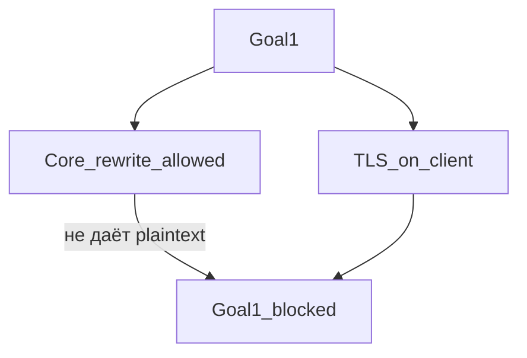
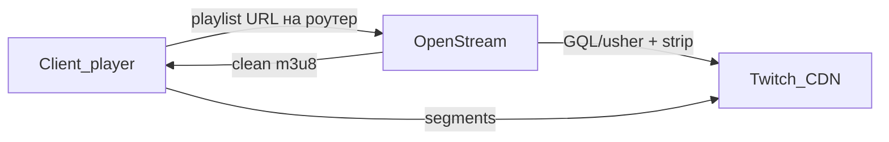
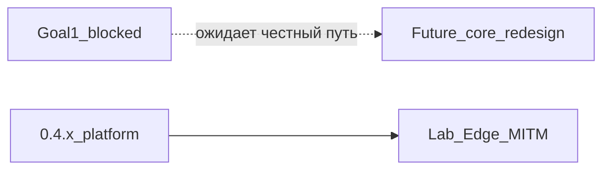

# OpenStream Engine — Roadmap

Актуальная база: **0.4.2** (IPK **14**). Оглавление: [INDEX.md](INDEX.md).

Связанные документы: [ARCHITECTURE.md](ARCHITECTURE.md), [PERFORMANCE.md](PERFORMANCE.md), [PLUGIN_ARCHITECTURE.md](PLUGIN_ARCHITECTURE.md), [PROXY_ARCHITECTURE.md](PROXY_ARCHITECTURE.md), [DASH_ARCHITECTURE.md](DASH_ARCHITECTURE.md), [COEXISTENCE.md](COEXISTENCE.md), [SDK.md](SDK.md), [adr/0001-plugin-abi.md](adr/0001-plugin-abi.md), [adr/0002-playlist-edge.md](adr/0002-playlist-edge.md), [adr/0003-goal1-router-only-tls.md](adr/0003-goal1-router-only-tls.md).

## Легенда статусов

- `[x]` выполнено и уже отражено в коде.
- `[~]` частично выполнено; нужен follow-up или проверка на реальной БД / живом CDN / SoC.
- `[ ]` не сделано.
- `[blocked]` заблокировано внешним окружением, данными или **криптографией (TLS)**.
- `[legacy]` / `[lab]` — opt-in / прототип; **не** закрытие Цели №1.

---

## Цель №1 (строго) — `[blocked]`

См. **[ADR 0003](adr/0003-goal1-router-only-tls.md)**.

| Требование | |
|------------|--|
| Логика на роутере | да |
| Все клиенты (ТВ / ПК / телефон / приставки; app / browser) | да |
| Ноль действий на клиенте (ни CA, ни URL, ни companion, ни VPN) | да |
| Компромиссы по клиенту | **не принимаются** |

**TLS-инвариант:** без trust anchor на устройстве роутер не читает/не меняет HTTPS m3u8. Ядро (`ose-proxy`, nft, …) **можно ломать** ради цели — это **не** обходит проверку сертификата на клиенте.

**Следствие:** продукт **не обещает** чистый Twitch во всех стоковых клиентах при нулевых действиях на устройстве. Честного пути сейчас нет.

---

## Lab-код (не Цель №1)

Инженерный прототип **не** выдавать за Goal №1:

| Lab path | Документ | Клиентское действие |
|----------|----------|---------------------|
| Playlist Edge | [ADR 0002](adr/0002-playlist-edge.md) | Другой URL (VLC / companion) |
| MITM + CA | PROXY transparent | CA в trust store |
| Companion H7 | Stage H | Расширение / userscript |

### Жёсткий факт TLS (кратко)

nft/dnsmasq/TPROXY ловят пакеты, не plaintext. Passiveive decrypt после TLS 1.3/PFS мёртв. Active MITM без CA на клиенте → handshake fail.

### Lab: Playlist Edge (код 0.4.x)

Роутер ходит за манифестом (GQL/usher), strip, отдаёт clean m3u8; сегменты с CDN. Клиент **сам** открывает `http://router:18080/twitch/<channel>` (или companion). Это **не** Goal №1.

---

## Принципы

- **Цель №1** выше lab UX; компромиссы Goal №1 не принимаются ([ADR 0003](adr/0003-goal1-router-only-tls.md)).
- **Ядро можно менять** целиком, если появится Goal1-совместимый механизм; до тех пор — не рефакторить «вслепую».
- Ядро универсально; сервисная логика в плагинах.
- Сосуществование с zapret / podkop / sing-box: [COEXISTENCE.md](COEXISTENCE.md).
- Сегменты медиа не в RAM (lab Edge).
- Lab Twitch = Segment Stripping; seamless — Stage G (lab).
- MITM + CA / Edge / companion — **не** решение Goal №1.

---

## Stage A — v1.0-hardened

| ID | Задача | Статус |
|----|--------|--------|
| A1 | MITM только `.m3u8` / `.mpd`; медиа — tunnel/stream | `[x]` |
| A2 | Cap размера манифеста; без полной буферизации `.ts` / `.m4s` | `[x]` |
| A3 | Persistent CA + leaf cache по host | `[x]` `[legacy]` для пути C |
| A4 | Режимы `explicit` / `redirect_whitelist` / `off` + fail-soft nft | `[x]` · transparent → demote в H |
| A5 | DISCONTINUITY после strip; строгий DATERANGE; настоящий `regex` | `[x]` |
| A6 | Proxy unit-тесты; host Criterion benches | `[x]` benches · `[~]` полевой RSS/CPU на SoC |
| A7 | LuCI ↔ демон (`max_wait`/debug/UCI→YAML); ad events | `[x]` каркас · `[~]` калибровка UX |
| A8 | Clippy + CI | `[x]` |

**Выход этапа:** каркас proxy/MITM закрыт; продуктовый default уходит в Stage H.

---

## Stage B — Universal HLS (v1.1 / 0.2.0)

| ID | Задача | Статус |
|----|--------|--------|
| B1 | Plugin API: `filter_segments` / `rewrite_urls` / `capabilities` | `[x]` |
| B2 | Rule engine YAML (`ose-rules`) | `[x]` |
| B3 | Kick / Trovo / generic HLS plugin | `[x]` stub · `[~]` маркеры на живом CDN |
| B4 | Master rewrite через `proxy_public_url` | `[x]` · база для Edge URL |
| B5 | Hot-reload `/api/reload` + SIGHUP | `[x]` |
| B6 | Prefetch policy ядра | `[x]` |

---

## Stage C — DASH (v2.0 / 0.3.0)

| ID | Задача | Статус |
|----|--------|--------|
| C1 | Парсер MPD (`ose-dash`) | `[x]` |
| C2 | Фильтр Period / AdaptationSet | `[x]` stub · `[~]` калибровка |
| C3 | CMAF passthrough | `[x]` |
| C4 | `MediaFilter` / `ManifestKind` (`ose-media`) | `[x]` |
| C5 | `CacheKey` (URL + etag/hash) | `[x]` |

---

## Stage D — Platform SDK (v3.0 / 0.4.x)

| ID | Задача | Статус |
|----|--------|--------|
| D1 | ADR 0001 static ABI + SDK.md + skeleton | `[x]` |
| D2 | Production-quality плагины | `[~]` strip + stubs |
| D3 | Singleflight coalesce (`ose-coalesce`) | `[x]` |
| D4 | OpenMetrics + event ring + LuCI | `[x]` |
| D5 | Profiles LTO/size + `slim-twitch` | `[x]` · `[~]` feed CI |
| D6 | Criterion benches + fixtures (0.4.2) | `[x]` |
| D7 | WASM / cdylib plugins | `[ ]` отложено ADR 0001 |

---

## Stage E — Полевая готовность и perf

Цель: цифры на SoC; не блокировать Stage H ожиданием CA на клиентах.

| ID | Задача | Статус |
|----|--------|--------|
| E1 | `VmRSS` / `VmPeak` на SoC | `[~]` GL-MT6000 idle RSS **~2.8 МБ**, Peak **~13.3 МБ**; под HLS TBD |
| E2 | CPU % при 1–N потоках | `[ ]` |
| E3 | Таблица в PERFORMANCE.md | `[~]` idle закрыт; нагрузка TBD |
| E4 | Criterion vs aarch64 | `[~]` |
| E5 | Живые Twitch midroll/preroll fixtures | `[ ]` · `[blocked]` CDN |
| E6 | Kick / Trovo / YouTube маркеры | `[ ]` · `[blocked]` |
| E7 | DASH ad Period | `[ ]` · `[blocked]` |
| E8 | Coexist zapret/podkop + hostlists (без требования CA) | `[~]` · полевой Edge smoke TBD |
| E9 | MITM CA на Android/iOS/TV | `[lab]` · не Goal №1 |
| E10 | Документация ipk/apk | `[~]` |

**Выход Stage E:** PERFORMANCE + fixtures; smoke без обязательного CA.

---

## Stage H — Playlist Edge `[lab]` (не Цель №1)

Инженерный прототип: strip без CA **только** если клиент сам ходит на Edge URL / companion. **Не** закрывает Goal №1 ([ADR 0003](adr/0003-goal1-router-only-tls.md)).

| ID | Задача | Статус |
|----|--------|--------|
| H0 | ADR Edge vs MITM | `[x]` [0002](adr/0002-playlist-edge.md) · **не Goal №1** |
| H1 | API Edge + nested | `[x]` · `[lab]` |
| H2 | GQL token на роутере; кэш | `[~]` |
| H3 | Strip media via rewrite | `[x]` r14 · `[lab]` |
| H4 | Default `mode=edge` в пакете (lab default, не Goal №1) | `[x]` |
| H5 | Сузить divert (сайт жив) | `[x]` |
| H6 | Hostlists multi-service / remote | `[x]` |
| H7 | Companion browser | `[ ]` · **не** спринт «решить Goal №1» |
| H8 | VLC deep-link в LuCI | `[~]` |
| H9 | Docs Edge lab | `[x]` |
| H10 | ADR 0003 Goal №1 + TLS blocked | `[x]` |

**Выход Stage H (lab):** VLC/companion smoke; **не** «все стоковые клиенты без касания устройства».

---

## Stage F — Production plugins (на Edge)

| ID | Задача | Статус |
|----|--------|--------|
| F1 | Twitch strip: регрессия на живых fixtures | `[~]` |
| F2 | False-positive политика по полевым логам | `[ ]` |
| F3–F5 | Kick / Trovo / YouTube Live production rulesets | `[~]` / `[ ]` |
| F6 | DASH: один реальный провайдер | `[ ]` |
| F7 | LuCI: freeze ≈ midroll (не vaft) | `[ ]` |
| F8 | Metrics под Edge нагрузкой | `[~]` |
| F9 | Multi-plugin priority | `[ ]` |
| F10 | Trim deps slim-twitch | `[~]` |

---

## Stage G — Opt-in seamless на Edge (не отдельный MITM-путь)

Реализуется **поверх H1–H2** (router GQL + backup encodings). Default = strip.

| ID | Задача | Статус |
|----|--------|--------|
| G0 | ADR token/playerType / ToS / кэш | `[ ]` → часть H0/H2 |
| G1 | Backup encodings (`embed` / `popout` / `autoplay`) | `[ ]` |
| G2 | Подмена media playlist при `stitched` | `[ ]` |
| G3 | Кэш StreamInfos-like; invalidation | `[ ]` |
| G4 | Fallback на strip | `[ ]` |
| G5 | Флаг `backup_seamless` включает G1–G4 | `[~]` scaffold |
| G6 | Метрики backup hit / strip fallback | `[ ]` |
| G7 | Документация vs browser-vaft | `[ ]` |

---

## Вне скоупа / отвергнуто для Goal №1

| Тема | Статус |
|------|--------|
| Transparent HTTPS inspect **без** CA / без клиента | **невозможно (TLS)** — Goal №1 blocked |
| Edge / companion / MITM+CA как «закрытие Goal №1» | отвергнуто ([ADR 0003](adr/0003-goal1-router-only-tls.md)) |
| Blanket divert `*.twitch.tv` | нет (ломает сайт) |
| Динамические `.so` / WASM plugins | отложено ADR 0001 |
| Патч Twitch app / Worker inject | вне модели |
| Буферизация медиа в RAM | запрещено |
| Twitch Turbo / эксплойты TLS / публичный CA abuse | вне продукта |

---

## Ближайший спринт

1. `[x]` **ADR 0003** — Цель №1 + TLS-инвариант; docs sync.
2. `[ ]` Мониторинг: появится ли **честный** Goal1-совместимый механизм (пока неизвестен).
3. `[ ]` Рефактор ядра — **только** после п.2; до тех пор lab Edge не расширять как продукт Goal №1.
4. `[ ]` **Не** делать H7 companion как «решение стены Goal №1».
5. `[lab]` Поддержка lab Edge (r14+) для разработчиков/VLC — без обещания всем клиентам.

Пакет lab: **0.4.2-14**. Goal №1: **blocked**.
